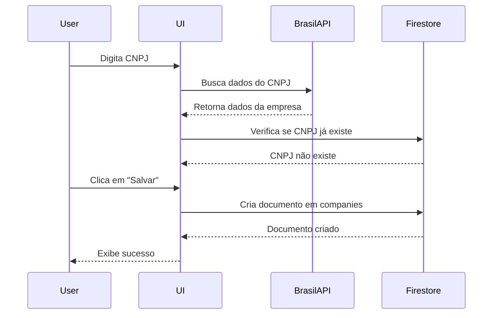
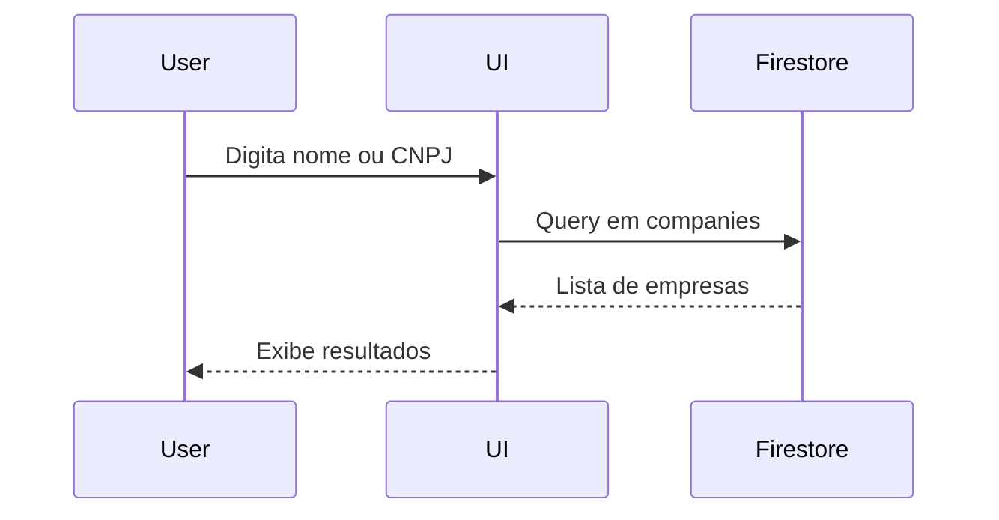

# Estrutura do Firestore - SealHub

## 📊 Coleções

### `companies` (Empresas/Clientes)

Armazena informações dos clientes cadastrados no sistema.

**Estrutura do Documento:**

```typescript
{
  // Dados básicos (da Receita Federal)
  cnpj: string              // CNPJ formatado (14 dígitos)
  name: string              // Nome fantasia ou razão social
  legalName?: string        // Razão social (se diferente)
  address: string           // Endereço completo
  type: 'headquarters' | 'branch'  // Matriz ou Filial
  status: 'active' | 'closed' | 'suspended'  // Situação cadastral
  
  // Dados complementares
  phone?: string            // Telefone
  email?: string            // E-mail de contato
  contactPerson?: string    // Nome do contato
  notes?: string            // Observações
  
  // Metadata
  createdAt: Timestamp      // Data de criação
  createdBy: string         // ID do usuário que criou
  updatedAt: Timestamp      // Data da última atualização
  lastSyncedAt?: Timestamp  // Última sincronização com Receita Federal
}
```

**Índices Necessários:**

- `cnpj` (ASC) - Para busca rápida por CNPJ
- `name` (ASC) - Para ordenação e busca por nome
- `createdAt` (DESC) - Para listar mais recentes primeiro

**Regras de Segurança (exemplo):**

```javascript
rules_version = '2';
service cloud.firestore {
  match /databases/{database}/documents {
    match /companies/{companyId} {
      // Permite leitura para usuários autenticados
      allow read: if request.auth != null;
      
      // Permite criação para usuários autenticados
      allow create: if request.auth != null
        && request.resource.data.createdBy == request.auth.uid
        && request.resource.data.cnpj is string
        && request.resource.data.name is string;
      
      // Permite atualização se for o criador ou admin
      allow update: if request.auth != null
        && (resource.data.createdBy == request.auth.uid);
      
      // Permite exclusão apenas para o criador
      allow delete: if request.auth != null
        && resource.data.createdBy == request.auth.uid;
    }
  }
}
```

## 🔄 Fluxo de Dados

### 1. Adicionar Novo Cliente



### 2. Buscar Cliente Existente



## 📦 Serviços Implementados

### `lib/firebase/companies.ts`

**Operações CRUD:**

- `createCompany(data)` - Cria nova empresa
- `getCompanyById(id)` - Busca por ID
- `getCompanyByCNPJ(cnpj)` - Busca por CNPJ
- `getAllCompanies()` - Lista todas as empresas
- `updateCompany(id, updates)` - Atualiza empresa
- `deleteCompany(id)` - Deleta empresa

**Operações de Busca:**

- `searchCompaniesByName(term)` - Busca por nome (case-insensitive)
- `searchCompaniesByCNPJ(digits)` - Busca por parte do CNPJ

**Operações Especiais:**

- `cnpjExists(cnpj)` - Verifica se CNPJ já está cadastrado
- `upsertCompanyFromReceita(data, userId)` - Cria ou atualiza com dados da Receita

## 🚀 Como Usar

### Exemplo 1: Adicionar Cliente

```typescript
import { upsertCompanyFromReceita } from '@/lib/firebase/companies'
import { fetchCNPJFromReceita } from '@/lib/cnpj-api'
import { useAuth } from '@/contexts/AuthContext'

function AddClient() {
  const { user } = useAuth()
  
  const handleAddClient = async (cnpj: string) => {
    // 1. Buscar na Receita Federal
    const receitaData = await fetchCNPJFromReceita(cnpj)
    
    // 2. Salvar no Firestore
    const savedCompany = await upsertCompanyFromReceita(
      receitaData,
      user.id
    )
    
    console.log('Cliente salvo:', savedCompany)
  }
}
```

### Exemplo 2: Buscar Clientes

```typescript
import { searchCompaniesByName } from '@/lib/firebase/companies'

async function searchClients(name: string) {
  const results = await searchCompaniesByName(name)
  console.log(`Encontrados ${results.length} clientes`)
  return results
}
```

### Exemplo 3: Verificar Duplicação

```typescript
import { cnpjExists } from '@/lib/firebase/companies'

async function checkDuplicate(cnpj: string) {
  const exists = await cnpjExists(cnpj)
  if (exists) {
    alert('CNPJ já cadastrado!')
  }
}
```

## 🔮 Próximas Entidades

### `campaigns`

```typescript
{
  id: string
  name: string
  description?: string
  sender: string
  observation: string
  instructions: {
    fragile: boolean
    attention: boolean
    handleWithCare: boolean
    thisWayUp: boolean
  }
  status: 'draft' | 'active' | 'completed' | 'cancelled'
  startDate?: Timestamp
  endDate?: Timestamp
  createdAt: Timestamp
  createdBy: string
  updatedAt: Timestamp
}
```

### `campaignClients` (Relacionamento N:N)

```typescript
{
  id: string
  campaignId: string
  companyId: string
  quantity?: number
  notes?: string
  status: 'pending' | 'printed' | 'shipped' | 'delivered'
  addedAt: Timestamp
  addedBy: string
}
```

### `seals` (Selos gerados)

```typescript
{
  id: string
  code: string
  campaignId: string
  companyId: string
  campaignClientId: string
  status: 'generated' | 'printed' | 'used' | 'cancelled'
  printedAt?: Timestamp
  printedBy?: string
  pdfUrl?: string
  pdfGeneratedAt?: Timestamp
  createdAt: Timestamp
  createdBy: string
}
```

## 📝 Notas Importantes

1. **Busca Case-Insensitive**: O Firestore não suporta busca case-insensitive nativamente. A implementação atual busca todos os documentos e filtra no cliente. Para produção, considere:
   - Usar Algolia Search
   - Criar campos normalizados (lowercase)
   - Usar Cloud Functions para indexação

2. **Timestamps**: Sempre use `Timestamp.now()` do Firestore em vez de `new Date()` para garantir consistência.

3. **Segurança**: Configure as regras de segurança no Firebase Console antes de ir para produção.

4. **Índices Compostos**: Se criar queries complexas (ex: filtrar por status E ordenar por data), crie índices compostos no Firebase Console.

5. **Paginação**: Para grandes volumes de dados, implemente paginação usando `startAfter()` e `limit()`.

## 🔗 Links Úteis

- [Documentação do Firestore](https://firebase.google.com/docs/firestore)
- [Regras de Segurança](https://firebase.google.com/docs/firestore/security/get-started)
- [Índices no Firestore](https://firebase.google.com/docs/firestore/query-data/indexing)
- [BrasilAPI - CNPJ](https://brasilapi.com.br/docs#tag/CNPJ)

