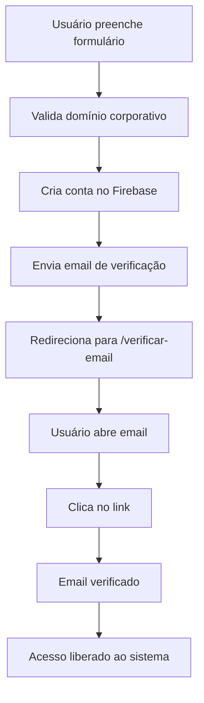
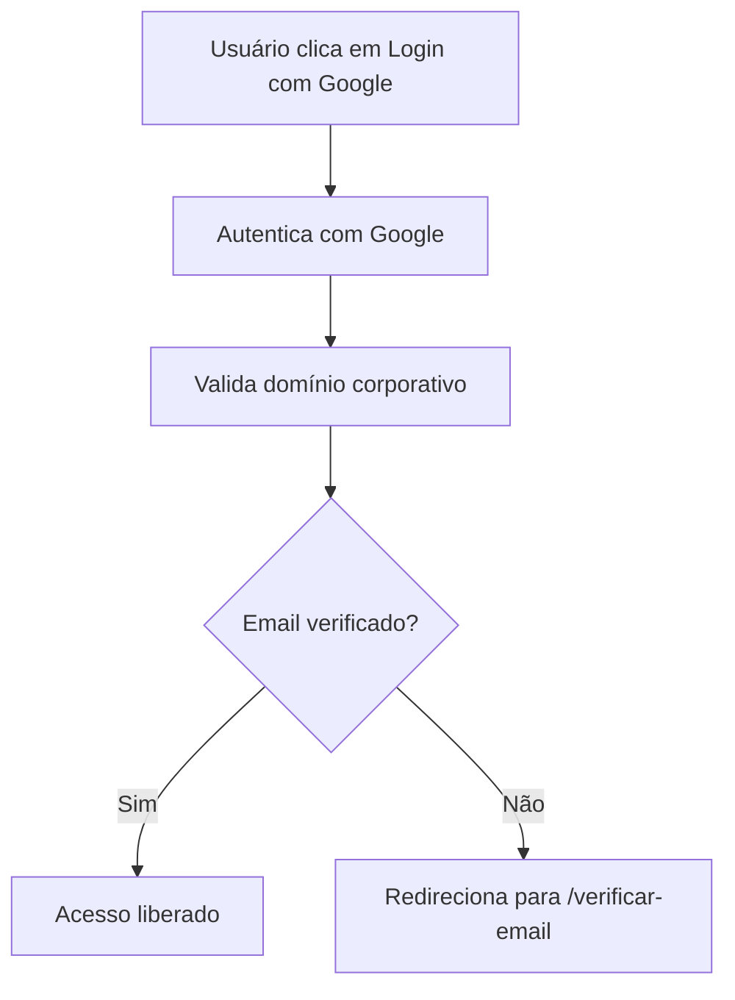
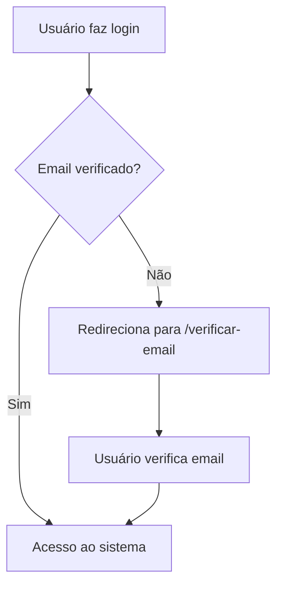

# Verificação de Email

## 📋 Visão Geral

O sistema implementa verificação de email obrigatória usando a funcionalidade nativa do Firebase Auth. Isso garante que:

1. ✅ O usuário realmente possui o email corporativo
2. ✅ O email é válido e está ativo
3. ✅ Aumenta a segurança da plataforma
4. ✅ Previne registros falsos

## 🔄 Fluxo de Verificação

### 1. Registro com Email/Senha



### 2. Login com Google



> **Nota:** O Google geralmente já verifica emails, então o login com Google normalmente libera acesso imediato.

### 3. Login com Email/Senha



## 🎯 Componentes Implementados

### 1. EmailVerificationPage

**Localização:** `/src/pages/auth/EmailVerificationPage.tsx`

**Funcionalidades:**
- Exibe instruções claras para o usuário
- Botão para verificar se o email já foi confirmado
- Botão para reenviar email de verificação
- Countdown de 60 segundos entre reenvios
- Link para fazer logout e usar outro email

**Interface:**
- ✉️ Ícone de email grande e visível
- 📝 Instruções passo a passo
- ⚠️ Avisos sobre pasta de spam
- ✅ Feedback visual ao verificar
- 🔄 Contador para reenvio

### 2. AuthContext - Novas Funções

**Função: `checkEmailVerification()`**
```typescript
const checkEmailVerification = async (): Promise<boolean> => {
  if (!auth.currentUser) return false
  
  // Recarrega o usuário para status atualizado
  await auth.currentUser.reload()
  
  const isVerified = auth.currentUser.emailVerified
  setIsEmailVerified(isVerified)
  
  return isVerified
}
```

**Estado: `isEmailVerified`**
- Rastreado em tempo real
- Atualizado no `onAuthStateChanged`
- Disponível em todo o contexto

### 3. PrivateRoute - Atualizado

**Nova Validação:**
```typescript
// Redireciona para verificação de email se não verificado
if (!isEmailVerified) {
  return <Navigate to="/verificar-email" replace />
}
```

Garante que apenas usuários com email verificado acessem rotas privadas.

### 4. Registro - Envio Automático

**No `register()`:**
```typescript
// Após criar a conta
await sendEmailVerification(userCredential.user)
toast.success('Conta criada com sucesso!', {
  description: 'Enviamos um email de verificação para você.',
})
navigate('/verificar-email')
```

## 📧 Email de Verificação

### Conteúdo Padrão do Firebase

O Firebase envia automaticamente um email com:
- **Assunto:** "Verificar seu e-mail para [Nome do Projeto]"
- **Conteúdo:** Link para verificação
- **Idioma:** Configurável no Firebase Console

### Personalização (Opcional)

Para personalizar o email de verificação:

1. Acesse o Firebase Console
2. Vá em **Authentication** → **Templates**
3. Selecione **Verificação de email**
4. Personalize:
   - Texto do email
   - Nome do remetente
   - URL de redirecionamento após verificação

### Configuração da URL de Redirecionamento

```typescript
// Para redirecionar após verificação
const actionCodeSettings = {
  url: 'https://seudominio.com/email-verificado',
  handleCodeInApp: true,
}

await sendEmailVerification(user, actionCodeSettings)
```

## 🔐 Segurança

### Proteção em Múltiplas Camadas

1. **Frontend (RegisterPage):**
   - Valida domínio antes de registrar
   
2. **Frontend (AuthContext):**
   - Envia email de verificação automaticamente
   - Bloqueia acesso até verificação
   
3. **Frontend (PrivateRoute):**
   - Redireciona para verificação se necessário
   
4. **Backend (Firestore Rules):**
   - Valida domínio no servidor
   - Pode adicionar verificação de email verificado

### Regras do Firestore (Opcional)

Para adicionar verificação no backend:

```javascript
// Em firestore.rules
match /users/{userId} {
  allow create, update: if request.auth != null
    && request.auth.uid == userId
    && request.auth.token.email_verified == true  // ← Adicione isto
    && isAllowedEmailDomain(request.auth.token.email);
}
```

## 🧪 Testando a Verificação

### Teste 1: Registro Novo

1. Crie uma conta com email corporativo
2. Verifique se foi redirecionado para `/verificar-email`
3. Abra o email recebido
4. Clique no link de verificação
5. Volte para a página de verificação
6. Clique em "Já verifiquei meu email"
7. Deve ser redirecionado para `/clientes`

### Teste 2: Login com Email Não Verificado

1. Tente fazer login com conta não verificada
2. Deve ser redirecionado para `/verificar-email`
3. Verifique o email
4. Tente acessar `/clientes` diretamente
5. Deve funcionar após verificação

### Teste 3: Reenvio de Email

1. Na página de verificação
2. Clique em "Reenviar email"
3. Verifique se aparece contador de 60 segundos
4. Verifique se recebeu novo email
5. Tente reenviar antes dos 60s (deve estar desabilitado)

### Teste 4: Login com Google

1. Faça login com conta Google corporativa
2. Deve acessar diretamente (Google já verifica)
3. Tente com conta Google pessoal
4. Deve ser bloqueado por domínio inválido

## 🐛 Troubleshooting

### Problema: Não recebi o email de verificação

**Soluções:**
1. Verifique a pasta de spam/lixo eletrônico
2. Verifique se o email está correto
3. Aguarde alguns minutos (pode haver delay)
4. Clique em "Reenviar email"
5. Verifique se o Firebase está configurado corretamente

### Problema: Email verificado mas sistema não reconhece

**Solução:**
1. Faça logout
2. Faça login novamente
3. O Firebase atualiza o status no login

Ou na página de verificação:
1. Clique em "Já verifiquei meu email"
2. O sistema força atualização do status

### Problema: Link de verificação expirou

**Solução:**
1. Links expiram após 3 dias por padrão
2. Clique em "Reenviar email"
3. Use o novo link recebido

### Problema: "Too many requests" ao reenviar

**Solução:**
1. O Firebase limita reenvios muito frequentes
2. Aguarde alguns minutos
3. Tente novamente

## ⚙️ Configurações Avançadas

### Alterar Tempo de Expiração

Por padrão, links expiram em 3 dias. Para alterar:

1. Acesse Firebase Console
2. **Authentication** → **Settings** → **Authorized domains**
3. Configure conforme necessário

### Configurar Idioma do Email

```typescript
import { auth } from '@/lib/firebase'

// Definir idioma para português
auth.languageCode = 'pt-BR'
```

Adicione isso em `/src/lib/firebase.ts`:

```typescript
// Após inicializar o auth
auth.languageCode = 'pt-BR'
```

### Personalizar Action URL

Para redirecionar após verificação:

```typescript
const actionCodeSettings = {
  url: window.location.origin + '/email-verificado',
  handleCodeInApp: false,
}

await sendEmailVerification(auth.currentUser, actionCodeSettings)
```

## 📊 Métricas e Monitoramento

### Firebase Console

Acompanhe no Firebase Console:
- **Authentication** → **Users**: Status de verificação
- **Analytics** (se configurado): Taxa de verificação
- **Error Logs**: Erros ao enviar emails

### Métricas Importantes

- Taxa de verificação: % de usuários que verificam email
- Tempo médio até verificação
- Taxa de reenvio de emails
- Emails que retornam (bounced)

## 🔄 Fluxo Alternativo: Verificação Opcional

Se você quiser tornar a verificação opcional no futuro:

1. Remova a validação do `PrivateRoute`
2. Adicione um banner na interface alertando
3. Limite funcionalidades para não verificados
4. Incentive verificação com benefícios

**Exemplo de banner:**
```typescript
{!isEmailVerified && (
  <div className="bg-yellow-50 p-4 text-center">
    <p>Seu email ainda não foi verificado.</p>
    <button onClick={() => navigate('/verificar-email')}>
      Verificar agora
    </button>
  </div>
)}
```

## 📚 Recursos Adicionais

- [Firebase Auth - Email Verification](https://firebase.google.com/docs/auth/web/manage-users#send_a_user_a_verification_email)
- [Customize Email Templates](https://firebase.google.com/docs/auth/custom-email-handler)
- [Email Link Authentication](https://firebase.google.com/docs/auth/web/email-link-auth)

## ✅ Checklist de Implementação

- [x] Criar EmailVerificationPage
- [x] Adicionar checkEmailVerification() no AuthContext
- [x] Atualizar registro para enviar email automaticamente
- [x] Atualizar login para verificar status
- [x] Atualizar PrivateRoute para bloquear não verificados
- [x] Adicionar rota /verificar-email
- [x] Implementar reenvio de email com countdown
- [x] Adicionar feedback visual e instruções
- [x] Testar todos os fluxos
- [ ] Personalizar email no Firebase Console (opcional)
- [ ] Configurar idioma português (opcional)
- [ ] Adicionar regra no Firestore (opcional)

