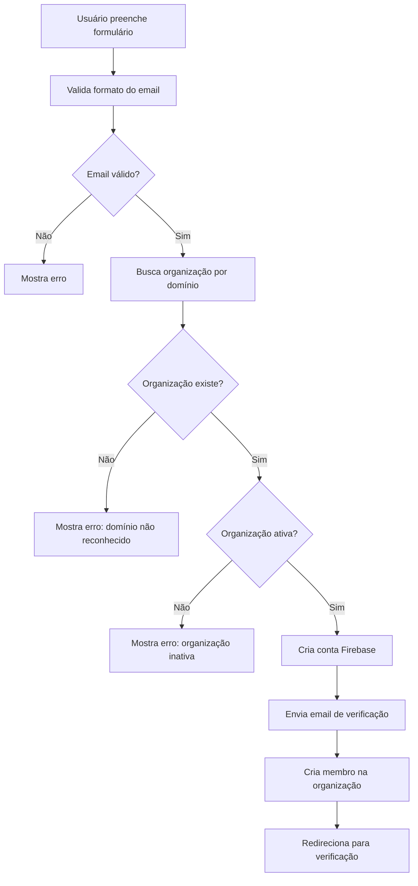
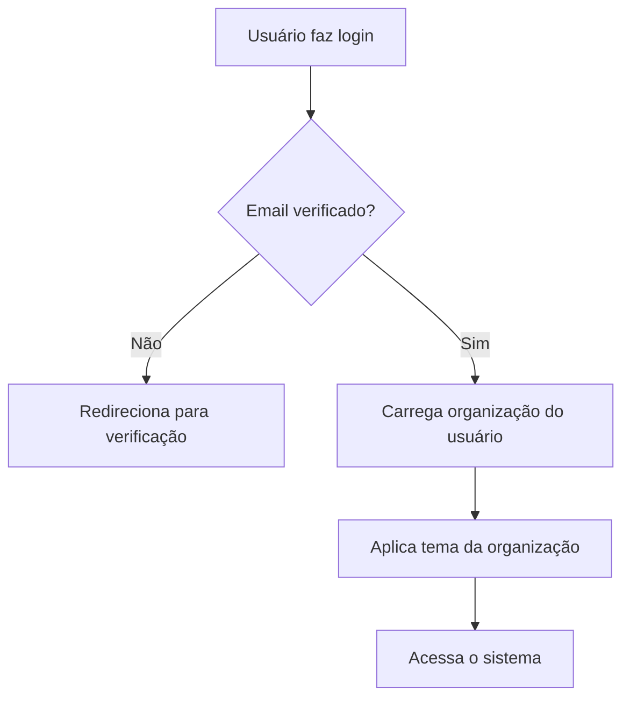

# Sistema Multi-Tenant - Estrutura de Organizações

## 📋 Visão Geral

O sistema foi estruturado para suportar **múltiplas empresas** (multi-tenant), onde cada organização possui:

- ✅ Domínios de email corporativo próprios
- ✅ Configurações de branding (cores, logo)
- ✅ Configurações personalizadas (remetente padrão, assinatura)
- ✅ Gestão de membros e permissões
- ✅ Limites e cotas por plano

## 🏗️ Estrutura do Firestore

### Coleção: `organizations`

```typescript
{
  id: "org_123",
  name: "IASA Brasil",
  tradeName: "IASA",
  cnpj: "12.345.678/0001-90",
  description: "Empresa de auditoria",
  status: "active", // active | inactive | suspended
  
  // Domínios de email permitidos
  emailDomains: [
    {
      domain: "@iasabrasil.com.br",
      active: true,
      addedAt: Timestamp,
      addedBy: "user_id"
    },
    {
      domain: "@iasa.com.br",
      active: true,
      addedAt: Timestamp,
      addedBy: "user_id"
    }
  ],
  
  // Tema/Branding
  theme: {
    primaryColor: "#D97B35",
    primaryHoverColor: "#C16A2A",
    lightBackgroundColor: "#FFF5ED",
    logoUrl: "https://...",
    faviconUrl: "https://..."
  },
  
  // Configurações
  settings: {
    defaultSender: "IASA Brasil",
    defaultSignature: "Att, Equipe IASA",
    campaignCodePrefix: "IASA",
    timezone: "America/Sao_Paulo",
    language: "pt-BR"
  },
  
  // Administradores
  adminUsers: ["user_id_1", "user_id_2"],
  
  // Plano
  plan: "premium", // free | basic | premium | enterprise
  
  // Limites
  limits: {
    maxUsers: 50,
    maxCampaigns: 1000,
    maxCompanies: 5000
  },
  
  // Metadata
  createdAt: Timestamp,
  createdBy: "user_id",
  updatedAt: Timestamp,
  updatedBy: "user_id"
}
```

### Coleção: `organizationMembers`

```typescript
{
  id: "member_123",
  userId: "user_id",
  organizationId: "org_123",
  email: "joao@iasabrasil.com.br",
  name: "João Silva",
  role: "admin", // admin | manager | member | viewer
  permissions: ["campaigns.create", "campaigns.edit"],
  status: "active", // active | invited | suspended
  joinedAt: Timestamp,
  invitedBy: "user_id"
}
```

### Atualização: `companies`

Adicionar campo `organizationId`:

```typescript
{
  id: "company_123",
  organizationId: "org_123", // ← NOVO
  cnpj: "12.345.678/0001-90",
  name: "Empresa Cliente LTDA",
  // ... resto dos campos
}
```

### Atualização: `campaigns`

Adicionar campo `organizationId`:

```typescript
{
  id: "campaign_123",
  organizationId: "org_123", // ← NOVO
  name: "Campanha 2025",
  sender: "IASA Brasil",
  // ... resto dos campos
}
```

### Atualização: `users`

Adicionar relação com organização:

```typescript
{
  id: "user_123",
  name: "João Silva",
  email: "joao@iasabrasil.com.br",
  currentOrganizationId: "org_123", // ← NOVO (organização ativa)
  // ... resto dos campos
}
```

## 🔄 Fluxo de Registro e Associação

### 1. Registro de Novo Usuário



### 2. Login



## 🎨 Sistema de Tema Dinâmico

### Como Funciona

1. **Ao fazer login**, o sistema carrega a organização do usuário
2. **OrganizationContext** aplica automaticamente o tema
3. **CSS Variables** são atualizadas em tempo real

### Tokens CSS Dinâmicos

```css
:root {
  --color-primary: /* Carregado da organização */
  --color-primary-hover: /* Carregado da organização */
  --color-primary-light: /* Carregado da organização */
}
```

### Exemplo de Uso

```typescript
// O tema é aplicado automaticamente
const { organization } = useOrganization()

// Cores já estão disponíveis via CSS variables
<Button style={{ backgroundColor: 'var(--color-primary)' }}>
  Clique aqui
</Button>
```

## 👥 Sistema de Permissões

### Papéis (Roles)

| Papel | Permissões |
|-------|-----------|
| **Admin** | Tudo: gerenciar org, usuários, campanhas, clientes |
| **Manager** | Criar/editar campanhas, visualizar clientes |
| **Member** | Criar campanhas, visualizar dados |
| **Viewer** | Apenas visualizar (read-only) |

### Verificação de Permissões

```typescript
const { organization, isAdmin } = useOrganization()

if (isAdmin) {
  // Mostrar opções de administração
}
```

## 🔐 Regras de Segurança do Firestore

### Organizations

```javascript
match /organizations/{organizationId} {
  // Qualquer usuário autenticado pode ler organizações ativas
  allow read: if request.auth != null 
    && resource.data.status == 'active';
  
  // Apenas admins da organização podem atualizar
  allow update: if request.auth != null
    && request.auth.uid in resource.data.adminUsers;
  
  // Apenas super-admins podem criar (implementar lógica específica)
  allow create: if request.auth != null
    && request.auth.token.email.matches('.*@admin\\.com$');
  
  // Apenas super-admins podem deletar
  allow delete: if false;
}
```

### Organization Members

```javascript
match /organizationMembers/{memberId} {
  // Usuário pode ler seus próprios dados
  allow read: if request.auth != null 
    && request.auth.uid == resource.data.userId;
  
  // Admins da organização podem ler todos os membros
  allow read: if request.auth != null
    && isOrganizationAdmin(resource.data.organizationId);
  
  // Admins podem adicionar/remover membros
  allow create, update, delete: if request.auth != null
    && isOrganizationAdmin(request.resource.data.organizationId);
}

function isOrganizationAdmin(orgId) {
  return exists(/databases/$(database)/documents/organizations/$(orgId))
    && get(/databases/$(database)/documents/organizations/$(orgId))
      .data.adminUsers.hasAny([request.auth.uid]);
}
```

### Companies (Atualizado)

```javascript
match /companies/{companyId} {
  // Apenas membros da mesma organização podem ler
  allow read: if request.auth != null
    && isSameOrganization(resource.data.organizationId);
  
  // Membros podem criar (com organizationId)
  allow create: if request.auth != null
    && request.resource.data.organizationId is string
    && isSameOrganization(request.resource.data.organizationId);
  
  // Membros podem atualizar
  allow update: if request.auth != null
    && isSameOrganization(resource.data.organizationId);
  
  // Apenas admins podem deletar
  allow delete: if request.auth != null
    && isSameOrganization(resource.data.organizationId)
    && isOrganizationAdmin(resource.data.organizationId);
}

function isSameOrganization(orgId) {
  return exists(/databases/$(database)/documents/organizationMembers/$(request.auth.uid))
    && get(/databases/$(database)/documents/organizationMembers/$(request.auth.uid))
      .data.organizationId == orgId;
}
```

## 📊 Funcionalidades Implementadas

### ✅ Backend (Firestore)

- [x] Tipos TypeScript completos
- [x] Funções CRUD para organizações
- [x] Validação de email por domínio
- [x] Gestão de membros
- [x] Busca de organização por usuário

### ✅ Frontend (React)

- [x] OrganizationContext
- [x] Hook `useOrganization()`
- [x] Aplicação automática de tema
- [x] Verificação de permissões

### 🚧 A Implementar

- [ ] Página de administração de organização
- [ ] Interface para adicionar/remover membros
- [ ] Interface para gerenciar domínios
- [ ] Interface para personalizar tema
- [ ] Dashboard por organização
- [ ] Relatórios separados por organização

## 🚀 Como Usar

### 1. Criar Primeira Organização

```typescript
import { createOrganization } from '@/lib/firebase/organizations'

const orgData = {
  name: 'IASA Brasil',
  tradeName: 'IASA',
  cnpj: '12.345.678/0001-90',
  emailDomains: ['@iasabrasil.com.br', '@iasa.com.br'],
  theme: {
    primaryColor: '#D97B35',
    primaryHoverColor: '#C16A2A',
  },
  settings: {
    defaultSender: 'IASA Brasil',
    timezone: 'America/Sao_Paulo',
  }
}

const org = await createOrganization(orgData, userId)
```

### 2. Usar no Componente

```typescript
import { useOrganization } from '@/contexts/OrganizationContext'

function MyComponent() {
  const { organization, isAdmin, isLoading } = useOrganization()
  
  if (isLoading) return <div>Carregando...</div>
  
  if (!organization) return <div>Sem organização</div>
  
  return (
    <div>
      <h1>{organization.name}</h1>
      <p>Remetente padrão: {organization.settings.defaultSender}</p>
      
      {isAdmin && (
        <button>Configurações da Organização</button>
      )}
    </div>
  )
}
```

### 3. Atualizar AuthContext

```typescript
// Ao registrar, buscar organização e associar
const validation = await validateEmailDomain(email)

if (!validation.isValid) {
  throw new Error(validation.message)
}

// Criar conta...
// Depois adicionar como membro
await addOrganizationMember(
  validation.organization!.id,
  userCredential.user.uid,
  'member',
  userCredential.user.uid,
  email,
  name
)
```

## 🎯 Próximos Passos

### 1. Interface de Admin

Criar página `/configuracoes/organizacao` com:
- Editar nome, descrição
- Gerenciar domínios de email
- Personalizar cores e logo
- Configurar remetente padrão
- Gerenciar membros

### 2. Onboarding

Criar fluxo para primeira organização:
- Detectar se usuário não tem organização
- Permitir criar nova ou solicitar convite
- Wizard de configuração inicial

### 3. Convites

Sistema de convite para novos membros:
- Admin envia convite por email
- Usuário aceita e é adicionado
- Controle de convites pendentes

### 4. Multi-Organizações

Permitir usuário pertencer a múltiplas organizações:
- Seletor de organização no TopBar
- Trocar entre organizações
- Dados isolados por organização

## 📚 Arquivos Criados

- `/src/types/organization.ts` - Tipos TypeScript
- `/src/lib/firebase/organizations.ts` - Funções Firestore
- `/src/contexts/OrganizationContext.tsx` - Context React
- `/docs/MULTI_TENANT_STRUCTURE.md` - Esta documentação

## ✅ Checklist de Implementação

- [x] Definir tipos TypeScript
- [x] Criar funções CRUD Firestore
- [x] Criar OrganizationContext
- [x] Sistema de tema dinâmico
- [x] Validação de email por domínio
- [x] Documentação completa
- [ ] Atualizar AuthContext
- [ ] Atualizar regras Firestore
- [ ] Criar página de admin
- [ ] Atualizar queries para filtrar por org
- [ ] Testes end-to-end

